# Core de pseudoWeb

Esta página concentra el mapa completo del core. Primero muestra el flujo general y después desciende por cada jerarquía interna del lexer, parser e interpreter.

## Flujo completo

```mermaid
graph TD
  Source["Fuente del programa"] --> Entry["src/index.ts"]
  Entry --> LexAPI["lexer/lexer.ts"]
  Entry --> ParseAPI["parser/parser.ts"]
  Entry --> EvalAPI["interpreter/evaluator.ts"]
  Entry --> EnvAPI["interpreter/environment.ts"]
  Entry --> Errors["errors.ts"]

  Source --> LexRun["Lexer.Lexer.tokenize()"]
  LexAPI --> LexRun
  LexRun --> ScanToken["scanToken()"]
  LexRun --> Tokens["Token[]"]
  ScanToken --> AddToken["addToken()"]
  ScanToken --> Advance["advance()"]
  ScanToken --> Peek["peek() / peekNext()"]
  ScanToken --> IsEnd["isAtEnd()"]

  Tokens --> ParseRun["Parser.Parser.parse()"]
  ParseAPI --> ParseRun
  ParseRun --> ParseProgram["parseProgram()"]
  ParseProgram --> ParseStatement["parseStatement()"]
  ParseProgram --> ParserState["ParserState"]

  ParseStatement --> ParseIf["parseIf()"]
  ParseStatement --> ParseWhile["parseWhile()"]
  ParseStatement --> ParseFor["parseFor()"]
  ParseStatement --> ParseWrite["parseWrite()"]
  ParseStatement --> ParseRead["parseRead()"]
  ParseStatement --> ParseVarDecl["parseVariableDeclaration()"]
  ParseStatement --> ParseAssign["parseAssignment()"]

  ParseIf --> ParseExpr["parseExpression()"]
  ParseWhile --> ParseExpr
  ParseFor --> ParseExpr
  ParseWrite --> ParseCommaList["parseCommaSeparatedList()"]
  ParseRead --> ParseCommaList
  ParseAssign --> ParseExpr
  ParseVarDecl --> ToDataType["toDataType()"]

  ParseExpr --> ParseOr["parseOr()"]
  ParseOr --> ParseAnd["parseAnd()"]
  ParseAnd --> ParseEquality["parseEquality()"]
  ParseEquality --> ParseComparison["parseComparison()"]
  ParseComparison --> ParseTerm["parseTerm()"]
  ParseTerm --> ParseFactor["parseFactor()"]
  ParseFactor --> ParsePower["parsePower()"]
  ParsePower --> ParseUnary["parseUnary()"]
  ParseUnary --> ParsePrimary["parsePrimary()"]
  ParsePrimary --> Binary["binary()"]
  ParsePrimary --> Consume["consume()"]
  ParseUnary --> ToUnary["toUnaryOperator()"]
  Binary --> ToBinary["toBinaryOperator()"]

  ParseProgram --> Utils["parserUtils.ts"]
  ParseStatement --> Utils
  ParseExpr --> Utils
  Utils --> Check["check()"]
  Utils --> CheckAny["checkAny()"]
  Utils --> CheckNext["checkNext()"]
  Utils --> Match["match()"]
  Utils --> ConsumeAny["consumeAny()"]
  Utils --> SkipSep["skipSeparators()"]
  Utils --> ParserErr["parserError()"]
  Utils --> Peek
  Utils --> Prev["previous()"]
  Utils --> Advance
  Utils --> IsEnd

  ParseRun --> AST["Ast.StatementNode[]"]
  AST --> EvalRun["Evaluator.evaluate()"]
  EvalAPI --> EvalRun

  EvalRun --> EvalStmt["evaluateStatement()"]
  EvalRun --> EvalBlock["evaluateBlock()"]
  EvalRun --> EvalExpr["evaluateExpression()"]
  EvalRun --> Output["output[]"]
  EvalRun --> Vars["variables snapshot"]

  EvalStmt --> EvalVarDecl["evaluateVariableDeclaration()"]
  EvalStmt --> EvalAssign["evaluateAssignment()"]
  EvalStmt --> EvalWrite["evaluateWrite()"]
  EvalStmt --> EvalRead["evaluateRead()"]
  EvalStmt --> EvalIf["evaluateIf()"]
  EvalStmt --> EvalWhile["evaluateWhile()"]
  EvalStmt --> EvalFor["evaluateFor()"]

  EvalIf --> IfNode["evaluateIfNode()"]
  EvalWhile --> WhileNode["evaluateWhileNode()"]
  EvalFor --> ForNode["evaluateForNode()"]
  EvalWrite --> WriteNode["evaluateWriteNode()"]
  EvalRead --> ReadNode["evaluateReadNode()"]

  EvalExpr --> ExprNode["evaluateExpressionNode()"]
  ExprNode --> UnaryNode["evaluateUnaryExpression()"]
  ExprNode --> BinaryNode["evaluateBinaryExpression()"]
  UnaryNode --> IsTruthy["isTruthy()"]
  BinaryNode --> ToNumber["toNumber()"]
  BinaryNode --> ToComparable["toComparable()"]

  EvalIf --> IsTruthy
  EvalWhile --> IsTruthy
  EvalFor --> ToNumber
  ForNode --> Bind["bindLoopVariable()"]
  EvalWrite --> Stringify["stringifyValue()"]
  EvalRead --> Input["inputValues"]

  EvalRun --> Environment["Environment"]
  Environment --> Define["define()"]
  Environment --> Assign["assign()"]
  Environment --> Lookup["lookup()"]
  Environment --> Has["has()"]
  Environment --> Snapshot["snapshot()"]

  ScanToken --> ScanIdentifier["scanIdentifierToken()"]
  ScanToken --> ScanNumber["scanNumberToken()"]
  ScanToken --> ScanString["scanStringToken()"]
  ScanToken --> SkipComment["skipBlockComment()"]
  ScanToken --> ScanOperator["scanOperatorToken()"]

  ScanIdentifier --> ResolveId["resolveIdentifierType()"]
  ScanIdentifier --> IsAlphaNum["isAlphaNumeric()"]
  ScanNumber --> IsDigit["isDigit()"]
  ScanOperator --> NextChar["peekNext()"]
  ScanOperator --> LexerErr["LexerError"]
  ScanString --> LexerErr
  SkipComment --> LexerErr

  Errors --> RuntimeErr["RuntimeError"]
  Errors --> LexerErr
  Errors --> ParserErr
  EvalExpr --> RuntimeErr
  EvalIf --> RuntimeErr
  EvalWhile --> RuntimeErr
  EvalFor --> RuntimeErr
  BinaryNode --> RuntimeErr
  UnaryNode --> RuntimeErr
```

## Jerarquía por capa

- [Lexer](core/lexer.md): tokenización, scanners y reglas de identificación.
- [Parser](core/parser.md): construcción del AST, sentencias, expresiones y utilidades de avance.
- [Interpreter](core/interpreter.md): evaluación del AST, control de flujo, I/O y entorno.

## Lectura recomendada

1. Empieza por src/index.ts para ver la API pública.
2. Sigue el flujo fuente -> tokens -> AST -> ejecución.
3. Baja a las páginas de detalle de cada capa para ver la lógica de cada función.