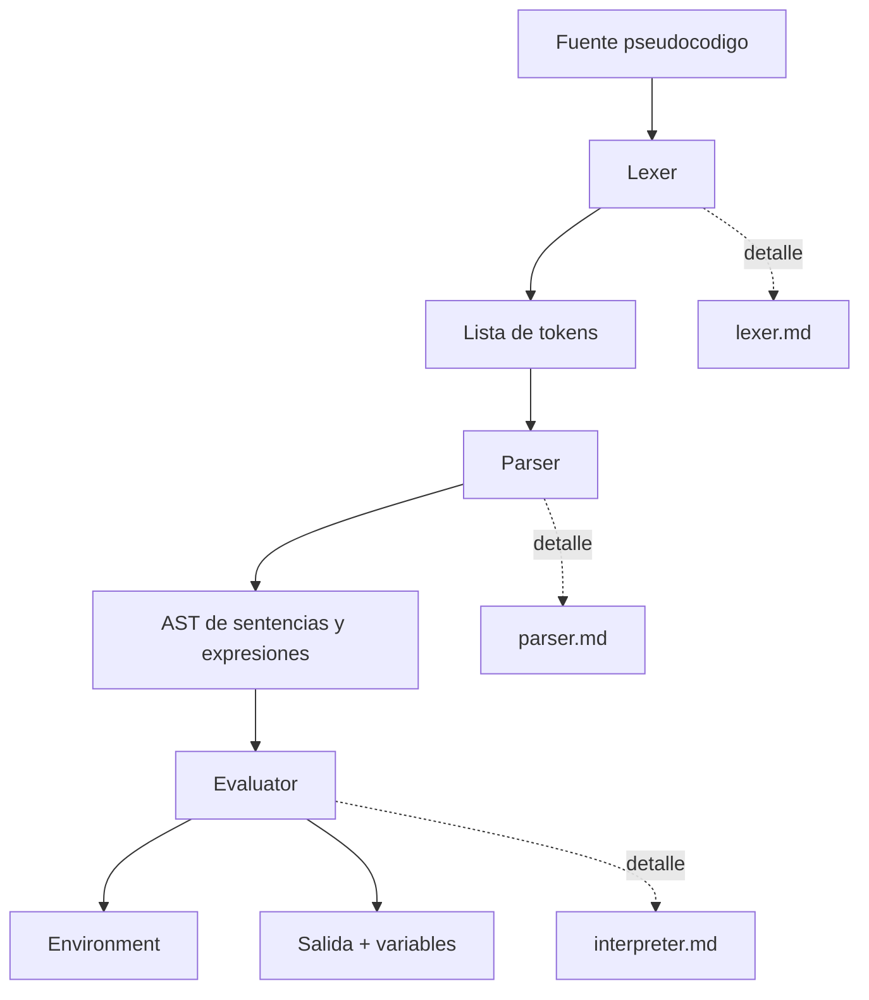
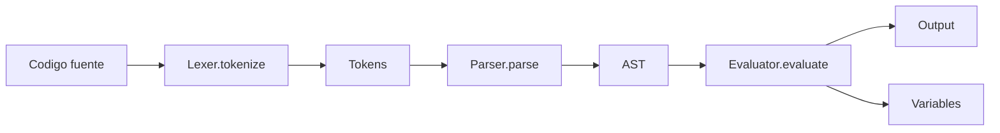

# Core en Mermaid

Este es el mapa de navegación del core. Primero muestra el flujo completo y después baja por capa hasta llegar a funciones concretas con sus líneas reales.

## Mapa General

## Cómo leerlo

1. Empezá por [packages/core/src/index.ts](../../packages/core/src/index.ts#L1) para ver qué exporta el core.
2. Seguí el flujo: [lexer.md](lexer.md) -> [parser.md](parser.md) -> [interpreter.md](interpreter.md).
3. Dentro de cada capa, buscá la línea de entrada principal y después las funciones subordinadas.

## Contratos públicos

- [packages/core/src/index.ts](../../packages/core/src/index.ts#L1) centraliza exportaciones.
- [packages/core/src/lexer/lexer.ts](../../packages/core/src/lexer/lexer.ts#L9) expone `Lexer.Lexer` y `tokenize()`.
- [packages/core/src/parser/parser.ts](../../packages/core/src/parser/parser.ts#L5) expone `Parser.Parser.parse()`.
- [packages/core/src/interpreter/evaluator.ts](../../packages/core/src/interpreter/evaluator.ts#L12) expone `Evaluator.evaluate()`.

## Subesquemas

- [Lexer](lexer.md)
- [Parser](parser.md)
- [Interpreter](interpreter.md)

## Vista por archivo

- [packages/core/src/lexer/lexer.ts](../../packages/core/src/lexer/lexer.ts#L9)
  - Orquesta la tokenización completa.
  - Se apoya en scanners especializados para números, cadenas, identificadores, comentarios y operadores.
- [packages/core/src/parser/parser.ts](../../packages/core/src/parser/parser.ts#L5)
  - Crea el estado del parser y delega en el orquestador de sentencias.
- [packages/core/src/interpreter/evaluator.ts](../../packages/core/src/interpreter/evaluator.ts#L12)
  - Recorre sentencias AST y delega la ejecución fina a módulos internos.

## Flujo resumido

