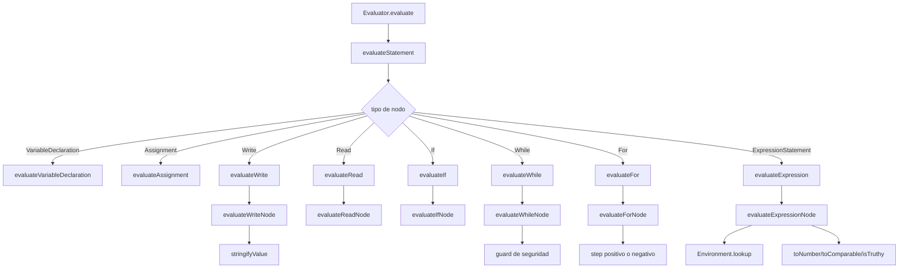

# Interpreter

El interpreter ejecuta el AST y produce salida, variables y errores runtime. La fachada está en [packages/core/src/interpreter/evaluator.ts](../../packages/core/src/interpreter/evaluator.ts#L12).

## Vista de flujo

## Archivo principal

- [packages/core/src/interpreter/evaluator.ts](../../packages/core/src/interpreter/evaluator.ts#L12)
  - [evaluate()](../../packages/core/src/interpreter/evaluator.ts#L21) recorre las sentencias y devuelve `output` + `variables`.
  - [evaluateStatement()](../../packages/core/src/interpreter/evaluator.ts#L34) distribuye por tipo de nodo.
  - [evaluateVariableDeclaration()](../../packages/core/src/interpreter/evaluator.ts#L65) crea variables con valor `null`.
  - [evaluateAssignment()](../../packages/core/src/interpreter/evaluator.ts#L71) asigna o define si la variable no existía.
  - [evaluateWrite()](../../packages/core/src/interpreter/evaluator.ts#L81) delega el render de salida.
  - [evaluateRead()](../../packages/core/src/interpreter/evaluator.ts#L92) consume la entrada disponible.
  - [evaluateIf()](../../packages/core/src/interpreter/evaluator.ts#L103), [evaluateWhile()](../../packages/core/src/interpreter/evaluator.ts#L113) y [evaluateFor()](../../packages/core/src/interpreter/evaluator.ts#L123) delegan flujo de control.
  - [evaluateBlock()](../../packages/core/src/interpreter/evaluator.ts#L133) ejecuta listas de sentencias.
  - [evaluateExpression()](../../packages/core/src/interpreter/evaluator.ts#L139) delega en el evaluador de expresiones.
- [packages/core/src/interpreter/environment.ts](../../packages/core/src/interpreter/environment.ts#L1)
  - [define()](../../packages/core/src/interpreter/environment.ts#L17), [assign()](../../packages/core/src/interpreter/environment.ts#L26), [lookup()](../../packages/core/src/interpreter/environment.ts#L42), [has()](../../packages/core/src/interpreter/environment.ts#L55) y [snapshot()](../../packages/core/src/interpreter/environment.ts#L66).

## Módulos de ejecución

- [packages/core/src/interpreter/evaluators/expressionEvaluator.ts](../../packages/core/src/interpreter/evaluators/expressionEvaluator.ts#L1)
  - [evaluateExpressionNode()](../../packages/core/src/interpreter/evaluators/expressionEvaluator.ts#L10) resuelve literales, identificadores, agrupaciones, unarios y binarios.
  - [evaluateUnaryExpression()](../../packages/core/src/interpreter/evaluators/expressionEvaluator.ts#L27) maneja `Resta` y `No`.
  - [evaluateBinaryExpression()](../../packages/core/src/interpreter/evaluators/expressionEvaluator.ts#L40) contiene aritmética, comparaciones y lógica.
- [packages/core/src/interpreter/evaluators/controlFlowEvaluator.ts](../../packages/core/src/interpreter/evaluators/controlFlowEvaluator.ts#L1)
  - [evaluateIfNode()](../../packages/core/src/interpreter/evaluators/controlFlowEvaluator.ts#L13) ejecuta then/else.
  - [evaluateWhileNode()](../../packages/core/src/interpreter/evaluators/controlFlowEvaluator.ts#L22) agrega el límite de seguridad.
  - [evaluateForNode()](../../packages/core/src/interpreter/evaluators/controlFlowEvaluator.ts#L35) calcula inicio, fin y paso.
  - [bindLoopVariable()](../../packages/core/src/interpreter/evaluators/controlFlowEvaluator.ts#L58) reasigna o define la variable del contador.
- [packages/core/src/interpreter/evaluators/ioEvaluator.ts](../../packages/core/src/interpreter/evaluators/ioEvaluator.ts#L1)
  - [evaluateWriteNode()](../../packages/core/src/interpreter/evaluators/ioEvaluator.ts#L13) serializa valores con `stringifyValue()`.
  - [evaluateReadNode()](../../packages/core/src/interpreter/evaluators/ioEvaluator.ts#L18) consume `inputValues` y asigna resultados.
- [packages/core/src/interpreter/utils/valueUtils.ts](../../packages/core/src/interpreter/utils/valueUtils.ts#L1)
  - [stringifyValue()](../../packages/core/src/interpreter/utils/valueUtils.ts#L3), [isTruthy()](../../packages/core/src/interpreter/utils/valueUtils.ts#L11), [toNumber()](../../packages/core/src/interpreter/utils/valueUtils.ts#L15), [toComparable()](../../packages/core/src/interpreter/utils/valueUtils.ts#L25).

## Cómo leer el flujo

1. `Evaluator.evaluate()` recibe sentencias ya parseadas.
2. `evaluateStatement()` toma cada nodo y lo manda a su handler.
3. El handler usa el entorno para leer/escribir estado.
4. La capa de utilidad centraliza conversiones para que el comportamiento sea consistente.