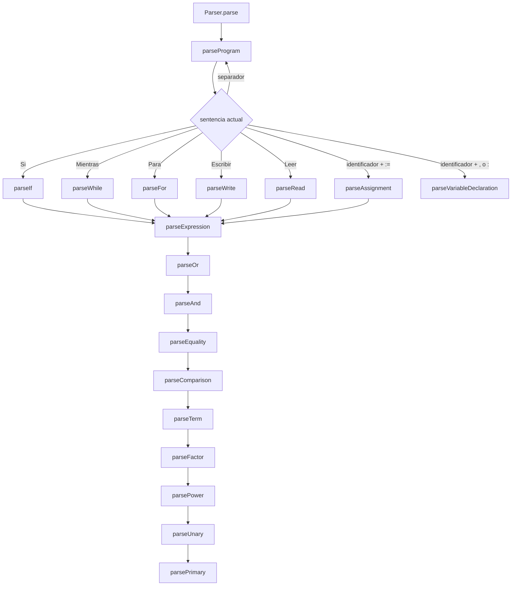

# Parser

El parser convierte tokens en AST. La fachada está en [packages/core/src/parser/parser.ts](../../packages/core/src/parser/parser.ts#L5).

## Vista de flujo

## Entrada principal

- [packages/core/src/parser/parser.ts](../../packages/core/src/parser/parser.ts#L5)
  - [Parser.Parser](../../packages/core/src/parser/parser.ts#L6) solo inicializa estado.
  - [parse()](../../packages/core/src/parser/parser.ts#L15) delega en `parseProgram()`.
- [packages/core/src/parser/parserState.ts](../../packages/core/src/parser/parserState.ts#L1)
  - Define el cursor compartido por el parser.
- [packages/core/src/parser/parserUtils.ts](../../packages/core/src/parser/parserUtils.ts#L1)
  - [peek()](../../packages/core/src/parser/parserUtils.ts#L5), [previous()](../../packages/core/src/parser/parserUtils.ts#L9), [advance()](../../packages/core/src/parser/parserUtils.ts#L17).
  - [check()](../../packages/core/src/parser/parserUtils.ts#L23), [checkAny()](../../packages/core/src/parser/parserUtils.ts#L30), [checkNext()](../../packages/core/src/parser/parserUtils.ts#L34).
  - [match()](../../packages/core/src/parser/parserUtils.ts#L39), [consume()](../../packages/core/src/parser/parserUtils.ts#L47), [consumeAny()](../../packages/core/src/parser/parserUtils.ts#L54).
  - [skipSeparators()](../../packages/core/src/parser/parserUtils.ts#L63) y [parserError()](../../packages/core/src/parser/parserUtils.ts#L68).

## Sentencias

- [packages/core/src/parser/parserStatements.ts](../../packages/core/src/parser/parserStatements.ts#L1)
  - [parseProgram()](../../packages/core/src/parser/parserStatements.ts#L7) recorre todo el archivo.
  - [parseStatement()](../../packages/core/src/parser/parserStatements.ts#L20) decide la sentencia a partir del token actual.
  - [parseVariableDeclaration()](../../packages/core/src/parser/parserStatements.ts#L36) lee declaraciones como `a, b : Entero`.
  - [parseAssignment()](../../packages/core/src/parser/parserStatements.ts#L46) consume `:=` y su expresión.
  - [parseWrite()](../../packages/core/src/parser/parserStatements.ts#L52) soporta `Escribir(expr, ...)` o `Escribir expr`.
  - [parseRead()](../../packages/core/src/parser/parserStatements.ts#L67) soporta `Leer(a, b)` o `Leer a, b`.
  - [parseIf()](../../packages/core/src/parser/parserStatements.ts#L82), [parseWhile()](../../packages/core/src/parser/parserStatements.ts#L92) y [parseFor()](../../packages/core/src/parser/parserStatements.ts#L101) modelan control de flujo.
  - [parseBlock()](../../packages/core/src/parser/parserStatements.ts#L114) agrupa sentencias hasta un token tope.

## Expresiones por precedencia

- [packages/core/src/parser/parserExpressions.ts](../../packages/core/src/parser/parserExpressions.ts#L1)
  - [parseExpression()](../../packages/core/src/parser/parserExpressions.ts#L6) entra por la raíz de expresiones.
  - [parseOr()](../../packages/core/src/parser/parserExpressions.ts#L10) y [parseAnd()](../../packages/core/src/parser/parserExpressions.ts#L19) manejan la lógica.
  - [parseEquality()](../../packages/core/src/parser/parserExpressions.ts#L28) y [parseComparison()](../../packages/core/src/parser/parserExpressions.ts#L37) manejan comparaciones.
  - [parseTerm()](../../packages/core/src/parser/parserExpressions.ts#L46) y [parseFactor()](../../packages/core/src/parser/parserExpressions.ts#L55) manejan suma/resta y multiplicación/división.
  - [parsePower()](../../packages/core/src/parser/parserExpressions.ts#L64) mantiene asociatividad derecha.
  - [parseUnary()](../../packages/core/src/parser/parserExpressions.ts#L74) resuelve menos unario y negación lógica.
  - [parsePrimary()](../../packages/core/src/parser/parserExpressions.ts#L83) resuelve literales, identificadores y grupos.
  - [binary()](../../packages/core/src/parser/parserExpressions.ts#L105) arma nodos binarios con posición del operador.

## Lectura mental

1. `parseProgram()` consume sentencias una por una.
2. `parseStatement()` selecciona la forma concreta de sentencia.
3. Las sentencias llaman a `parseExpression()` cuando necesitan condiciones o valores.
4. `parseExpression()` baja por niveles de precedencia hasta `parsePrimary()`.